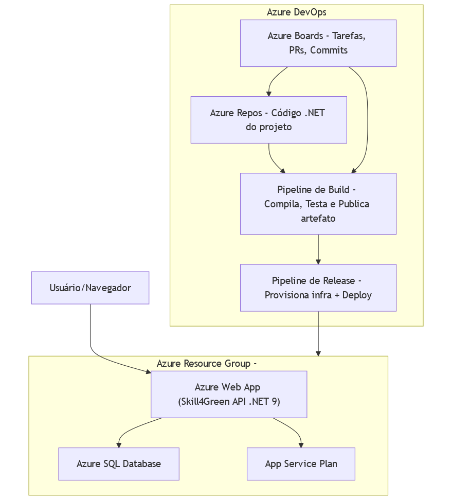

# Skill4Green API

Skill4Green é uma API RESTful desenvolvida em .NET voltada para promover práticas sustentáveis no ambiente corporativo por meio de pontuações e recompensas. A solução se alinha ao tema “O Futuro do Trabalho”, incentivando engajamento ambiental, gamificação e reconhecimento de ações verdes.

---

## Conexão com o Futuro do Trabalho

Skill4Green representa o futuro do trabalho ao:

- Promover cultura ESG nas empresas;
- Reconhecer ações sustentáveis de colaboradores;
- Gamificar metas ambientais;
- Engajar equipes com impacto positivo.

---

## Tecnologias Utilizadas

- ASP.NET Core 9;
- Entity Framework Core;
- SQL Server Database;
- FluentValidation;
- Swagger + Swashbuckle;
- OpenTelemetry;
- xUnit para testes;
- HealthChecks.

---

## Arquitetura Macro – Skill4Green



> Este diagrama representa a arquitetura da solução Skill4Green, dividida em dois blocos principais:

- **Azure DevOps**: gerencia o ciclo de desenvolvimento com Azure Boards (tarefas e PRs), Azure Repos (código .NET), Pipeline de Build (compilação, testes e publicação de artefato) e Pipeline de Release (provisionamento da infraestrutura e deploy automático).

- **Azure Resource Group**: agrupa os recursos da aplicação em nuvem, incluindo o Azure Web App (onde a API Skill4Green é hospedada), o Azure SQL Database (armazenamento das pontuações e recompensas) e o App Service Plan (plano de execução da aplicação).

O fluxo mostra como o código é versionado, testado e implantado automaticamente, permitindo que o usuário acesse a API em produção com dados persistidos no banco.

---

## Estrutura da API

### Versionamento

Todos os endpoints estão versionados via rotas:

```
/api/v1/pontuacoes
/api/v1/recompensas
```

Configuração via `AddApiVersioning` e `AddVersionedApiExplorer`.

---

### Endpoints principais

#### Pontuações

| Método | Rota                    | Descrição                    |
|--------|-------------------------|------------------------------|
| GET    | /api/v1/pontuacoes      | Lista paginada de pontuações |
| GET    | /api/v1/pontuacoes/{id} | Detalhes de uma pontuação    |
| POST   | /api/v1/pontuacoes      | Cria nova pontuação          |
| PUT    | /api/v1/pontuacoes/{id} | Atualiza pontuação existente |
| DELETE | /api/v1/pontuacoes/{id} | Remove pontuação             |

#### Recompensas

| Método | Rota                     | Descrição                     |
|--------|--------------------------|-------------------------------|
| GET    | /api/v1/recompensas      | Lista paginada de recompensas |
| GET    | /api/v1/recompensas/{id} | Detalhes de uma recompensa    |
| POST   | /api/v1/recompensas      | Cria nova recompensa          |
| PUT    | /api/v1/recompensas/{id} | Atualiza recompensa existente |
| DELETE | /api/v1/recompensas/{id} | Remove recompensa             |

---

## HATEOAS

Todos os recursos retornam links navegáveis no padrão:

```json
{
  "data": {
    "id": 1,
    "nome": "Joãozinho",
    "ecoCoins": 100,
    "nivelVerde": 3
  },
  "links": [
    { "rel": "self", "href": "/api/v1/pontuacoes/1", "method": "GET" },
    { "rel": "update", "href": "/api/v1/pontuacoes/1", "method": "PUT" },
    { "rel": "delete", "href": "/api/v1/pontuacoes/1", "method": "DELETE" },
    { "rel": "collection", "href": "/api/v1/pontuacoes", "method": "GET" }
  ]
}
```

---

## Monitoramento e Observabilidade

- Health Check: rota /health (Retorna Healthy ou Unhealthy dependendo do estado atual da aplicação);
- Logging com `ILogger<T>`;
- Tracing com OpenTelemetry (`AddConsoleExporter`)

---

## Testes

- Testes automatizados com `xUnit`;
- Testes de integração com banco em memória;
- Cobertura com coverlet.

```bash
dotnet test
```

---

## Migrations

```bash
dotnet ef migrations add Initial
dotnet ef database update
```

---

## Como executar

```bash
dotnet run
```

Acesse a API em: `http://localhost:5000`

---

## Documentação Swagger

Disponível em: `http://localhost:5000/swagger`

Inclui exemplos de requisição e resposta para todos os endpoints.

---

## Exemplos de JSON de Requisição

### Criar Pontuação (POST `/api/v1/pontuacoes`)

```json
{
  "nome": "caio123",
  "ecoCoins": 100,
  "nivelVerde": 2,
  "atualizadoEm": "2025-11-11T00:30:00"
}
```

### Atualizar Pontuação (PUT `/api/v1/pontuacoes/{id}`)

```json
{
  "nome": "caio123",
  "ecoCoins": 1000,
  "nivelVerde": 5,
  "atualizadoEm": "2025-11-11T01:00:00"
}
```

---

### Criar Recompensa (POST `/api/v1/recompensas`)

```json
{
  "nome": "Copo reutilizável",
  "custoEcoCoins": 50,
  "tipo": "Sustentável"
}
```

### Atualizar Recompensa (PUT `/api/v1/recompensas/{id}`)

```json
{
  "nome": "Copo térmico reutilizável",
  "custoEcoCoins": 60,
  "tipo": "Sustentável"
}
```

---

### Trocar Recompensa (POST `/api/v1/recompensas/trocar`)

```json
{
  "nome": "caio123",
  "recompensaId": 1
}
```

---

## Exemplos de JSON de Resposta

### Pontuação com HATEOAS

```json
{
  "data": {
    "id": 1,
    "nome": "caio123",
    "ecoCoins": 100,
    "nivelVerde": 2
  },
  "links": [
    { "rel": "self", "href": "/api/v1/pontuacoes/1", "method": "GET" },
    { "rel": "update", "href": "/api/v1/pontuacoes/1", "method": "PUT" },
    { "rel": "delete", "href": "/api/v1/pontuacoes/1", "method": "DELETE" },
    { "rel": "collection", "href": "/api/v1/pontuacoes", "method": "GET" }
  ]
}
```
---

### Recompensa com HATEOAS
```json
{
  "data": {
    "id": 1,
    "nome": "Copo reutilizável",
    "custoEcoCoins": 50,
    "tipo": "Sustentável"
  },
  "links": [
    { "rel": "self", "href": "/api/v1/recompensas/1", "method": "GET" },
    { "rel": "update", "href": "/api/v1/recompensas/1", "method": "PUT" },
    { "rel": "delete", "href": "/api/v1/recompensas/1", "method": "DELETE" },
    { "rel": "trocar", "href": "/api/v1/recompensas/trocar?nome={nome}&recompensaId=1", "method": "POST" },
    { "rel": "collection", "href": "/api/v1/recompensas", "method": "GET" }
  ]
}
```

---

### Resposta de Troca de Recompensa

```json
"Recompensa 'Copo reutilizável' trocada com sucesso."
```